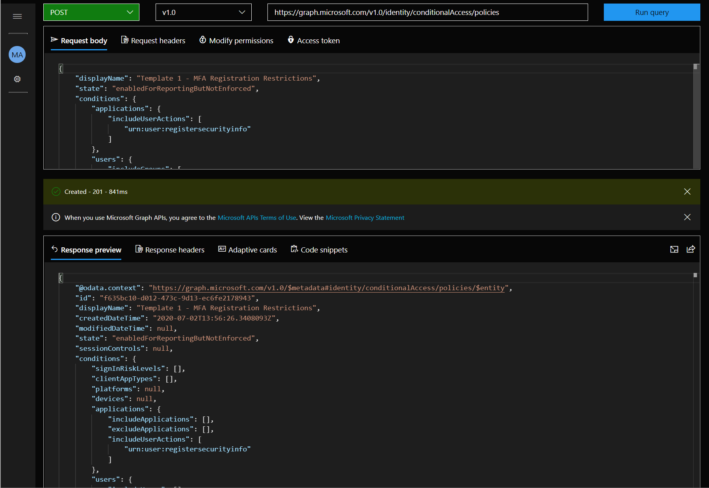

# One-click deploy templates for Conditional Access policies

This is the equivalent of your quick-start templates in your favourite IDE. We have made templates available that you can One-click Deploy to your organization. These includes top used CA policies and sophisticated policies incorporating other products like MCAS. You can deploy these templates with one click to your organization. Fork this repository, and you can create templates specific to your organization’s needs that you can make available to your branch offices and subsidiaries!

# Pre-requisites

Conditional Access APIs can be called by Global administrators, Security administrators, Conditional Access administrators (recommended), and Global readers (can only use the read APIs). The ability to manage conditional access policies is very powerful, so be sure to enforce Template 2 below which will require MFA for these roles!

# Why do you need these templates

As a small and medium-size business you may want to have a simple way to track top 10 policies that you need to create for your organization. For large enterprise, we have created policy sets based on 5 key dimensions of conditional access [**here**](https://github.com). 

# Template 1 - MFA Registration Restrictions.

Conditional Access Policy using MFA Registration Restrictions feature is one of the top 5 configured policies globally. This template allows you to control the conditions in which security sensitive MFA or SSPR information can be registered. This helps ensure it’s the right user—not an attacker—registering this security sensitive info. 

Some common restrictions you can include are:

1. Users are on a trusted network.
2. Only users with a low sign-in risk can register security information.
3. Users can only register on a managed device.
4. Users should agree to a terms of use during registration.

Make sure that all users you want to apply this policy to are part of the [combined MFA and SSPR experience](https://techcommunity.microsoft.com/t5/azure-active-directory-identity/combined-mfa-and-password-reset-registration-is-now-generally/ba-p/1257355). This is required because users not within scope of combined registration will use the older security information page and the policy will not be enforced. 

This template applies the trusted network restriction to new MFA registration. Now, if a user is outside of a trusted network and attempts to register MFA for first time, they will be blocked. As soon as they register MFA, they’ll be able to manage MFA and SSPR registration details from anywhere by performing MFA or when using a compliant or Hybrid Azure AD joined device.

If you would like to apply restrictions to users that are already registered but are now updating their registration information change the template to use the block control.

[**One Click Deploy this Template**](https://developer.microsoft.com/en-us/graph/graph-explorer?request=identity/conditionalAccess/policies&method=POST&version=v1.0&GraphUrl=https://graph.microsoft.com&requestBody=eyJkaXNwbGF5TmFtZSI6IlRlbXBsYXRlIDEgLSBNRkEgUmVnaXN0cmF0aW9uIFJlc3RyaWN0aW9ucyIsInN0YXRlIjoiZW5hYmxlZEZvclJlcG9ydGluZ0J1dE5vdEVuZm9yY2VkIiwiY29uZGl0aW9ucyI6eyJhcHBsaWNhdGlvbnMiOnsiaW5jbHVkZVVzZXJBY3Rpb25zIjpbInVybjp1c2VyOnJlZ2lzdGVyc2VjdXJpdHlpbmZvIl19LCJ1c2VycyI6eyJpbmNsdWRlR3JvdXBzIjpbIjZjOTY3MTZiLWIzMmItNDBiOC05MDA5LTQ5NzQ4YmI2ZmNkNSJdLCJleGNsdWRlR3JvdXBzIjpbImY3NTMwNDdlLWRlMzEtNGM3NC1hNmZiLWMzODU4OTA0NzcyMyJdfSwibG9jYXRpb25zIjp7ImluY2x1ZGVMb2NhdGlvbnMiOlsiQWxsIl0sImV4Y2x1ZGVMb2NhdGlvbnMiOlsiQWxsVHJ1c3RlZCJdfX0sImdyYW50Q29udHJvbHMiOnsib3BlcmF0b3IiOiJPUiIsImJ1aWx0SW5Db250cm9scyI6WyJtZmEiLCJjb21wbGlhbnREZXZpY2UiLCJkb21haW5Kb2luZWREZXZpY2UiXX19). All you need to do is press 'Run query' in graph explorer. Make sure you have the right permissions by clicking Modify permissions button and consenting to any missing permissions. [Click here](https://docs.microsoft.com/en-us/graph/) to learn more on Graph Explorer.

# Template 2 - Require MFA for elevated privileged accounts

Accounts that are assigned administrative rights are targeted by attackers. Requiring multi-factor authentication (MFA) on those accounts is an easy way to reduce the risk of those accounts being compromised.

We recommend you require MFA on the following roles at a minimum:

1. Billing administrator
2. Conditional Access administrator
3. Exchange administrator
4. Global administrator
5. Helpdesk (Password) administrator
6. Password administrator
7. Security administrator
8. SharePoint administrator
9. User administrator

Organizations can choose to include or exclude roles as they see fit.

# What do you get from this automation

Autopilot provides fully automated exclusions of emergency access accounts when you create new conditional access policies. 

Autopilot will make fully automated adjustments to your policies in case of accidental or malicious deletion of emergency access accounts, so you don’t get locked out!	

