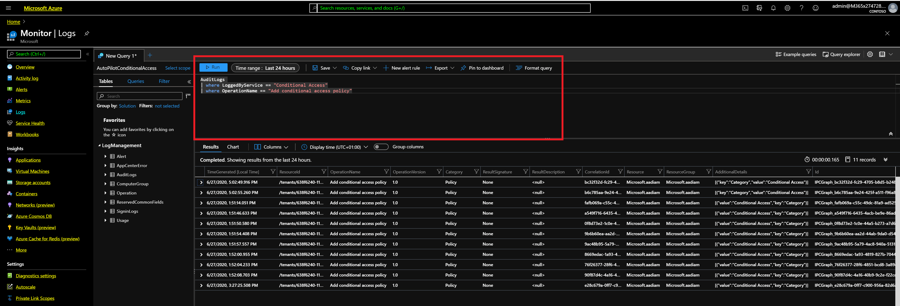

# Azure Active Directory Conditional Access APIs and audit logs

Azure Active Directory Conditional Access APIs writes audit logs containing activity information about Conditional access policy changes. This article provides a brief overview of the information available in audit logs and instructions on how to access this data for your tenant.

Audit log events are only retained for seven days. Plan to download and store your logs using one of the methods shown below if you require a longer retention period.

# Overview of activities available in the Azure AD Conditional Access category of audit logs

The Azure AD Conditional Access category in audit logs contains the following types of activities:

# Azure Monitor to manage alerts on policy changes

Use Azure Monitor to route Azure Active Directory Conditional Access auditing logs. 

See the [**Create Emergency Accounts**](https://docs.microsoft.com/en-us/azure/active-directory/users-groups-roles/directory-emergency-access) for how to create, configure and manage emergency access accounts. 

